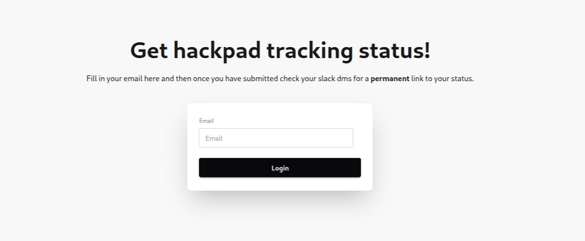

## Hackpad tracker!

made in ruby and contains v\*be code

This was made because alex was like someone should make a hackpad tracker which uses airtable and nobody did it in time soooo i made it cuz i got bored.
at the time of writing this i still dont have prod creds so.
